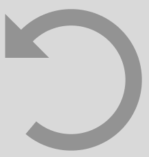
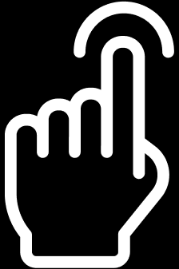
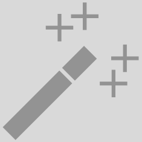
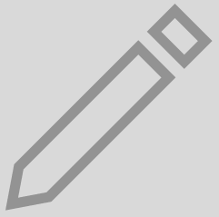
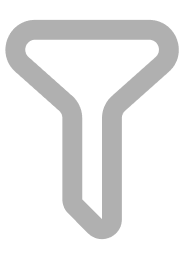
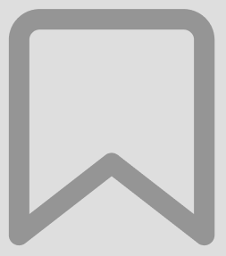
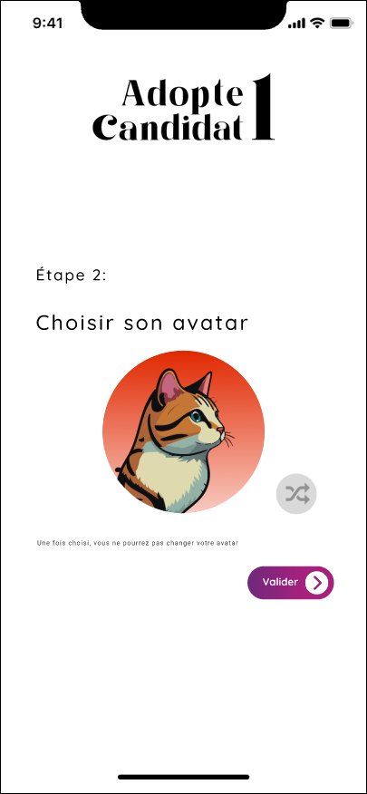

# Functional Specifications

## Table of content

- [Document control](#document-control)
    - [Document information](#document-information)
    - [Document validation](#document-validation)
- [A. Introduction](#a-introduction)
    - [1. Overview](#1-overview)
    - [2. Project definition](#2-project-definition)
        - [Vision](#vision)
        - [Objectives](#objectives)
        - [Scope](#scope)
        - [Deliverables](#deliverables)
    - [3. Project organization](#3-project-organization)
        - [Stakeholders](#stakeholders)
        - [Project team](#project-team)
- [B. Functional requirements](#b-functional-requirements)
    - [1. Personas definition](#1-personas-definiton)
    - [2. Features](#2-features)
    - [3. Graphic charter](#3-graphic-charter)
        - [Logo](#logo)
        - [Font](#font)
        - [Colors](#colors)
        - [Images and icons](#images-and-icons)
    - [4. UI/UX](#4-uiux)
        - [Registering](#registering)
            - [Job seeker](#job-seeker)
            - [Company](#company)
        - [Logging in](#logging-in)
        - [Job seeker interface](#job-seeker-interface)
            - [Searching companies](#searching-companies)
            - [Discussion with companies](#discussion-with-companies)
            - [Profile page](#profile-page)
            - [Saved companies](#saved-companies)
            - 
        - [Company interface](#job-seeker-interface)
            - [Searching job seekers](#searching-job-seekers)
            - [Discussion with job seekers](#discussion-with-job-seekers)
            - [Profile page](#profile-page)
            - [Saved job seekers](#saved-job-seekers)
            - 
- [C. Non functional requirements](#c-non-functional-requirements)
    - [1. Operability](#1-operability)
    - [2. Delivery](#2-delivery)
    - [3. Maintainability](#3-maintainability)
- [D. Glossary](#d-glossary)
  

# Document control

## Document information

| Document name | Document owner | Date of last update |
| --- | --- | --- |
| Functional specifications | Evan UHRING | 5/22/2024 |

## Document validation

| Role | Name | Signature | Date |
|---|---|---|---|
| Project Manager | Camille GAYAT |  |  |
| Tech Lead | Mathias GAGNEPAIN |  |  |
| Software Developer | Ian LAURENT |  |  |
| Quality Assurance | Pierre GORIN |  |  |
| Technical Writer | Guillaume DESPAUX |  |  |
  

# A. Introduction

## 1. Overview

Our team was asked to design and develope an interface of an application called Adopte Un Candidat. It is a recruitment app between job seekers and companies, while completely anonymizing the job seekers to focus on their soft-skills other than their gender, how they look and their experiences. It has to be available on smartphones, tablets and computers.

## 2. Project definition

### Vision
---

We will have a complete interface that was validated by the client. Every requested features have to be implemented.

### Objectives 
---

- Make a complete interface for an app
- Has to be made using Flutter
- Can be used on smartphone, tablet and computer

### Scope 
---

| In scope |
| --- |
|

| Out of scope |
| --- |
|

### Deliverables
---

| Name | Type | Deadline | Link |
|---|---|---|---|
| Functional specifications document | Document (markdown) | 05/24/2024 | [functional_specifications.md](functional_specifications.md) |
| Technical specifications document | Document (markdown) | 06/07/2024 | [technical_specifications.md](../technical/technical_specifications.md)|
| Weekly reports | Document (markdown) | Every Friday | [weekly_reports/](../management/weekly_reports)|
| Test plan | Document (markdown) | 06/07/2024 | [test_plan.md](../quality/) |
| User manual | Document (pdf) | 06/14/2024 | [test_plan.md](../quality/) |

## 3. Project organization

### Stakeholders
---

### Project team
---

Defined by the project owner (ALGOSUP):

| Role | Description | Name |
|---|---|---|
| Project manager | Is in charge of organization, planing and budgeting. Keep the team motivated. | Camille GAYAT |
| Program manager | Makes sure the project meets expectation. Is in charge of design. Is responsible for writing the Functional Specifications | Evan UHRING |
| Tech lead | Makes the technical decision in the project. Translates the Functional Specification into Technical Specifications.  Does code review. | Mathias GAGNEPAIN |
| Software engineer | Writes the code. Writes documentation Participate in the technical design. | Ian LAURENT |
| Quality assurance |  Tests all the functionalities of a product to find bugs and issue. Document bugs and issues. Write the test plan. Check that issues have been fixed.| Pierre GORIN |
| Technical writer | Is in charge of writing a user manual | Guillaume DESPAUX |
  

# B. Functional requirements

## 1. Personas definition

**Young candidate:** 
Description: He just finished school and got his diploma, but he needs to find efficiently a job. 

**Experienced worker:** 
Description: His contract is coming to an end and needs to find another one.

**The company:** 
Description: The company needs to find candidate on who they can trust and that they know how he will be socially with the other members of the company.

## 2. Features

## 3. Graphic charter

! All colors are shown with its hexadecimal code !

### Logo
---

The logo of the app was given by the client: 

### Fonts
---

The chosen fonts are **Roboto** and **Quicksand**. It mixes refined and modern styles together for a more attractive interface. **Quicksand** is mostly used for big texts and buttons' texts while **Roboto** is used for descriptions, box field texts and other texts.

### Colors
---

For the colors, we will separate them into different categories: 

- Light and dark background
- App main colors
- Theme main colors
- Soft-skills
- Compatibility percentage

**Light and dark background** 
For the background, we will have two different type: a light and a dark. The user will be able to choose between them following their preferences.

The light background will use a pure white: 

The dark background will use a specific dark grey, to still be able to visual the pages while not hurting the eyes of the user and be pleasant to see: 

**App main colors** 
The app main colors are represented by the image below: 

**Theme main colors** 
For the theme main colors, we decided to not use the same colors for every users. As such, we will randomize the color for each user and fade it with the same color plus 75% of the color of the background. For the company side of the app, the color will not be randomized. It will be the same color as the logo of the company and fade it with the same color plus 75% of the color of the background.

**Soft-skills** 
While the soft-skills are categorized with 4 main categories, we will put a color for each one: 
 
 
 

**Compatibility percentage** 
For the compatibility percentage, to make it more visible, we decided to use 5 colors and make them fade with each other: 

### Image and icons
---

To have an pleasant interface, we have made multiple icons and images. For the first 3 icons, the unselected versions have a color depending the theme color of the user, while the selected version is pure white (FFFFFF):

- Swipe page icon (selected - unselected):  - 

- Chat page icon (selected - unselected):  - 

- Account page icon (selected - unselected):  - 

Those icons are used on the main selection bar, to switch between the different main pages.

The other icons are used for more generic utilization, with fixed colors for each type of background (light and dark):

- "Burger" menu icon:  (color: FFFFFF)

- Undo icon:  (color: 939393)

- Click icon:  (color: FFFFFF)

- Crop tool icon:  (color: 939393)

- Enhance tool icon:  (color: 939393)

- Pencil icon:  (color: 939393)

- Randomize icon:  (color: 939393)

- Filter icon:  (color: B0B0B0)

- Search icon:  (color: 939393)

- Return icon:  (color: 939393)

- Save icon:  (color: 939393)
  

To assure that the candidates are correctly anonymized while keeping the interface attractive, we will be using animal images for the profile picture for the candidates: 

made by AI

## 4. UI/UX

The format used for smartphone is the format of the Iphone X. 
For the computer version, the format used is the standard 16/9 screen ratio.

### Logging in
---

The first page the user will arrive on is the connecting page:

On this page the user can choose to connect by entering his email address or by using other ways to connect by using Google, Apple or LinkedIn. If the user don't have an account, he can create one by clicking the button "créer" (create) just below.

If the user chooses to connect by entering your email address and presses 'enter' or clicks on the arrow at the right of the text box, he is redirected on a page where he has to enter his password where his name is shown for the candidate (left) or the company name for the company (right):

Then if the user has correctly entered his password and pressed 'enter' or clicked on the arrow, he will enter the app.

### Registering
---

If the user is using the app for the first time and does not have an account, he will click on the button "créer" (create) on the connecting page then he will be redirected to a page where he has to tell if he is a candidate or a company:

When in this page, the user can still go back to the connection page by clicking the button "connexion" (connection) just below.

#### Job seeker

If the user clicks on the button "un candidat" (a candidate), he will arrive at first on page where he will enter his name and surname. Those information will stay anonymized by the other users:

If he has chosen the wrong button (candidate other than company), he can still go back to the selection page by clicking the black arrow below on the left.

If the user decides to continue, he will have to input his email address. The email address will be useful when he will have to connect to the app or when he will show his email address the a company:

To be sure that the correct name was given by the user just before, his name will be shown where "(prénom)" (name) is.

After giving his email address, the candidate arrives on a email address verification page. This will help to input the correct email address:

If the wrong email was input, the user can still go back to input the correct email address.

When the correct verification code is given by the user, he will arrive on a new page where he will input a password for his account. He will have to input it twice to be sure that he is not mistaking:

Then on the next page after validating his password, the user will have to give some information about his professional status, what type of job does he want and his professional experiences. Those information will stay anonymized for the other users, it is mostly to collect data on which sector of activity is the most requested:

After all the information given by the user, the user will have now to choose what will be visible to others, starting by a nickname. The nickname is randomly generated using two words from the dictionary that go well together. It can not be manually input by the user to stay anonymized, as said in the message:

If the user is not happy by the nickname, he can still reroll for a new one by clicking the randomize button at the right of the nickname.

Then a profile picture will be given to the user, also randomly. The profile pictures are all an animal:

As well as the nickname, the user will be able to reroll for a better profile picture if he does not like the one that was given. Every profile pictures are shown in the graphic charter section in ["images and icons"](#image-and-icons).

#### Company

### Job seeker interface
---

#### Searching companies

#### Discussion with companies

#### Account page

#### Saved companies

### Company interface
---

#### Searching job seekers

#### Discussion with job seekers

#### Account page

#### Saved job seekers

  

# C. Non functional requirements

## 1. Operability

- Should be able to run on smartphone, tablet and computer
- Should run on every operating system

## 2. Delivery

- The complete application frontend will be available on our [GitHub](https://github.com/algosup/2023-2024-project-5-flutter-team-6).

## 3. Maintainability

- Commented and documented code
  

# D. Glossary

| Word | Definition | Source |
| --- | --- | --- |