# Functional Specifications

## Table of content

- [Document control](#document-control)
    - [Document information](#document-information)
    - [Document validation](#document-validation)
- [A. Introduction](#a-introduction)
    - [1. Overview](#1-overview)
    - [2. Project definition](#2-project-definition)
        - [Vision](#vision)
        - [Objectives](#objectives)
        - [Scope](#scope)
        - [Deliverables](#deliverables)
    - [3. Project organization](#3-project-organization)
        - [Stakeholders](#stakeholders)
        - [Project team](#project-team)
- [B. Functional requirements](#b-functional-requirements)
    - [1. Personas definition](#1-personas-definiton)
    - [2. Features](#2-features)
        - [Soft-skills](#soft-skills)
        - [Anonymized candidates](#anonymized-candidates)
        - [Matching system](#matching-system)
        - [Saving system](#saving-system)
    - [3. Graphic charter](#3-graphic-charter)
        - [Logo](#logo)
        - [Font](#font)
        - [Colors](#colors)
        - [Images and icons](#images-and-icons)
    - [4. UI/UX](#4-uiux)
        - [Logging in](#logging-in)
        - [Registering](#registering)
            - [Job seeker](#job-seeker)
            - [Company](#company)
        - [Job seeker interface](#job-seeker-interface)
            - [Searching companies](#searching-companies)
            - [Discussion with companies](#discussion-with-companies)
            - [Account page](#candidate-account)
            - [Saved companies](#saved-companies)
            - [Others](#candidate-others)
        - [Company interface](#job-seeker-interface)
            - [Searching candidates](#searching-candidates)
            - [Discussion with candidates](#discussion-with-candidates)
            - [Account page](#company-account)
            - [Saved candidates](#saved-candidates)
            - [Others](#company-others)
            - [Computer version](#computer-version)
- [C. Non functional requirements](#c-non-functional-requirements)
    - [1. Operability](#1-operability)
    - [2. Delivery](#2-delivery)
    - [3. Maintainability](#3-maintainability)
- [D. Glossary](#d-glossary)
  

# Document control

## Document information

| Document name | Document owner | Date of last update |
| --- | --- | --- |
| Functional specifications | Evan UHRING | 5/24/2024 |

## Document validation

| Role | Name | Signature | Date |
|---|---|---|---|
| Project Manager | Camille GAYAT | ✅ | 05/24/2024 |
| Tech Lead | Mathias GAGNEPAIN | ✅ | 5/24/2024 |
| Software Developer | Ian LAURENT |  |  |
| Quality Assurance | Pierre GORIN |  |  |
| Technical Writer | Guillaume DESPAUX | ✅ | 5/24/2024 |

  

# A. Introduction

## 1. Overview

Our team was asked to design and develope an interface<a href="#1">[1]</a> of an application<a href="#2">[2]</a> called Adopte Un Candidat. It is a recruitment app between job seekers and companies, while completely anonymizing the job seekers to focus on their soft-skills<a href="#3">[3]</a> rather than their gender, how they look and their experiences. It has to be available on smartphones, tablets and computers.

## 2. Project definition

### Vision
---

We will have a complete interface that was validated by the client. Every requested features have to be implemented.

### Objectives 
---

- Make a complete interface for the app
- Has to be made using Flutter<a href="#4">[4]</a>
- Can be used on smartphone, tablet and computer

### Scope 
---

| In scope |
| --- |
| Design the interface of the app |
| Deliver the front-end<a href="#5">[5]</a> of the app |
| Must be programmed using Flutter |
| Make it usable on smartphone, tablet and computer |
| Focus on the soft-skills feature and candidates' anonyma |
| Must be in French |

| Out of scope |
| --- |
| Every information of the user are visible by other users |
| Change the name and the logo of the app |
| Make it usable on only one platform<a href="#6">[6]</a> |

### Deliverables
---

| Name | Type | Deadline | Link |
|---|---|---|---|
| Functional specifications document | Document (markdown) | 05/24/2024 | [functional_specifications.md](functional_specifications.md) |
| Technical specifications document | Document (markdown) | 06/07/2024 | [technical_specifications.md](../technical/technical_specifications.md)|
| Weekly reports | Document (markdown) | Every Friday | [weekly_reports/](../management/weekly_reports)|
| Test plan | Document (markdown) | 06/07/2024 | [test_plan.md](../quality/) |
| User manual | Document (pdf) | 06/14/2024 | [test_plan.md](../quality/) |

## 3. Project organization

### Stakeholders
---

| Name | Occupation | Links |
| --- | --- | --- |
| we are evolution. | Client | [Website](https://www.we-are-evolution.com) |
| ALGOSUP | Third party | [Website](https://algosup.com) |

### Project team
---

| Role | Description | Name |
|---|---|---|
| Project manager | Is in charge of organization, planing and budgeting. Keep the team motivated. | Camille GAYAT |
| Program manager | Makes sure the project meets expectation. Is in charge of design. Is responsible for writing the Functional Specifications | Evan UHRING |
| Tech lead | Makes the technical decision in the project. Translates the Functional Specification into Technical Specifications.  Does code review. | Mathias GAGNEPAIN |
| Software engineer | Writes the code. Writes documentation Participate in the technical design. | Ian LAURENT |
| Quality assurance |  Tests all the functionalities of a product to find bugs and issue. Document bugs and issues. Write the test plan. Check that issues have been fixed.| Pierre GORIN |
| Technical writer | Is in charge of writing a user manual | Guillaume DESPAUX |
  

# B. Functional requirements

## 1. Personas definition

| **Young candidate:** | **Experienced worker:** | **A company:** |
| --- | --- | --- |
|  |  |  |
| Name: Ethan James | Name: Liam Alexander | Name: Sophie Grace |
| Age: 21 | Age: 44 | Age: 37 |
| Problem: He just finished school and got his diploma, but he needs to find efficiently a job. | Problem: His contract is coming to an end and needs to find another one. | Problem: The company needs to find candidate on who they can trust and that they know how he will be socially with the other members of the company. |
| What he wants: he would appreciate something that will help him finding a job that can accept junior worker. | What he wants: he wants something that can help him to find a new job efficiently without the need of doing a lot of things to be recruited. | What she wants: a way of looking for candidates easily without the need of looking through thousands of websites and social-networks and on which she can recruit by looking for the best soft-skills. |

## 2. Features

We were asked to focus on two main features: the soft-skills prioritization and anonymizing candidates. Also two other features will be implemented, which one was requested and the other is decided by us to add more possibilities for the app: a matching system and a saving system.

### Soft-skills

The task of prioritizing the soft-skills is that the company will search for candidates only using soft-skills as representative to select one. As such, the human aspect is increased other than looking for their skills.

We made some research and decided to use 58 different soft-skills split into 4 categories listed below:
- Social
- Self-management
- Analytical
- Interpersonal

This is the list of soft-skills with their correct categories: 
| Soft-skills | Categories | ---------- | Soft-skills | Categories |
| --- | --- | :---: | --- | --- |
| Empathy | Social | - | Perseverance | Self-management |
| Patience | Social | - | Set achievable goals for success | Self-management |
| Customer relationship management | Social | - | Time management | Self-management |
| Positivity | Social | - | Adaptability | Self-management |
| Confidence | Social | - | Managing time | Self-management |
| Interpersonal communication | Interpersonal | - | Assess your strengths | Self-management |
| Start Small | Social | - | Personal development | Self-management |
| Active listening | Social, Analytical, Interpersonal | - | Take care of yourself | Self-management |
| Cooperation | Social | - | Research | Analytical |
| Respect | Social | - | Problem solving | Analytical |
| Answer questions | Social | - | Forecasting | Analytical |
| Flexibility | Social, Interpersonal | - | Data analysis | Analytical |
| Create social goals | Social | - | Attention to detail | Analytical |
| Keep up with current events | Social | - | Diagnosis | Analytical |
| Teamwork | Social | - | Observation | Analytical |
| Conflict resolution | Social, Interpersonal | - | Critical thinking | Analytical |
| Nonverbal communication | Social | - | Identify the problem | Analytical |
| Leadership | Social, Interpersonal | - | Troubleshooting | Analytical |
| Eye | Social | - | Brainstorming | Analytical |
| Feedback | Social | - | Reporting | Analytical |
| Emotional intelligence | Social | - | Managerial skills | Analytical |
| Negotiation | Social | - | Criticism | Interpersonal |
| Using manners | Social | - | Collaboration | Interpersonal |
| Goal setting | Self-management | - | Motivation | Interpersonal |
| Self-motivation | Self-management | - | Building relationships | Interpersonal |
| Decision-making | Self-management, Analytical | - | Communication | Interpersonal |
| Organization | Self-management | - | Responsibility  | Interpersonal |
| Stress management | Self-management | - | Dependability | Interpersonal |
| Accountability | Self-management | - | Prioritization | Self-management |

They are not evenly distributed and some of them are in multiple categories but they are the most common soft-skills, and for those who are in multiple categories, the user will choose the one with the main category that describes him the best.

### Anonymized candidates

As we were tasked to focus on soft-skills, it requires anonymizing the candidates that was also what we were requested to do. By anonymizing the candidates, only their soft-skills will be shown to the other users, to eliminate discrimination, bias selection by competences, to focus more on the human aspect of the recruitment. If the company needs to know more about a candidate, they will be able to chat via a chat system implemented in the app.

### Matching system

The goal of the matching system is to detect when a candidate and a company validated each other's profile. When a matching occurs, they will be able to talk to each other via a private chat implemented in the app.

### Saving system

The saving system that we will implement will be used to save profiles that can be useful later but on which we don't want them to be prioritized. As such, when a profile is saved, it does not mean that it is validated and so the matching system will not work. Saved profiles will be accessible and then the user will be able to finally decides if he reject or validate the profile.

## 3. Graphic charter

! All colors are shown with its hexadecimal code !

### Logo
---

The logo of the app was given by the client: 

### Fonts
---

The chosen fonts are **Roboto**(Regular) and **Quicksand**(Medium). It mixes refined and modern styles together for a more attractive interface. **Quicksand** is mostly used for big texts and buttons' texts while **Roboto** is used for descriptions, box field texts and other texts.

### Colors
---

For the colors, we will separate them into different categories: 
- Light and dark background
- App main colors
- Theme main colors
- Soft-skills
- Compatibility percentage

**Light and dark background** 
For the background, we will have two different type: a light and a dark. The user will be able to choose between them following their preferences.

The light background will use a pure white: 

The dark background will use a specific dark grey, to still be able to visual the pages while not hurting the eyes of the user and be pleasant to see: 

**App main colors** 
The app main colors are represented by the image below: 

**Theme main colors** 
For the theme main colors, we decided to not use the same colors for every users. As such, we will randomize the color for each user and fade it with the same color plus 75% of the color of the background. For the company side of the app, the color will not be randomized. It will be the same color as the logo of the company and fade it with the same color plus 75% of the color of the background.

**Soft-skills** 
While the soft-skills are categorized with 4 main categories, we will put a color for each one: 
 
 
 

**Compatibility percentage** 
For the compatibility percentage, to make it more visible, we decided to use 5 colors and make them fade with each other: 

### Image and icons
---

To have an pleasant interface, we have made multiple icons and images. For the first 3 icons, the unselected versions have a color depending the theme color of the user, while the selected version is pure white (FFFFFF):

- Swipe page icon (selected - unselected):  - 

- Chat page icon (selected - unselected):  - 

- Account page icon (selected - unselected):  - 

Those icons are used on the main selection bar, to switch between the different main pages.

The other icons are used for more generic utilization, with fixed colors:

- "Burger" menu icon:  (color: FFFFFF)

- Click icon:  (color: FFFFFF)

- Randomize icon:  (color: 939393)

- Filter icon:  (color: B0B0B0)

- Search icon:  (color: 939393)

- Return icon:  (color: 939393)

- Save icon:  (color: 939393)

- Arrow icon: 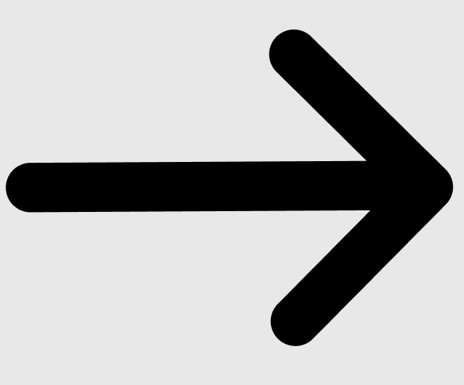 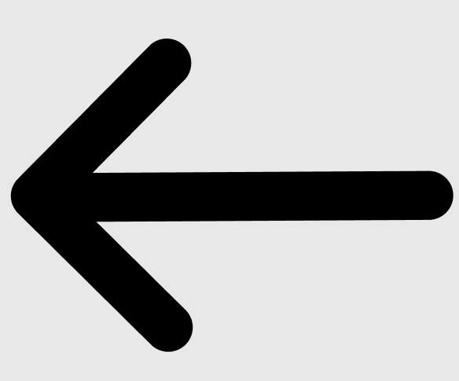 (color: 000000)
  

To assure that the candidates are correctly anonymized while keeping the interface attractive, we will be using animal images for the profile picture for the candidates: 

made by AI

## 4. UI/UX

The format used for smartphone is the format of the Iphone X. 
For the computer version, the format used is the standard 16/9 screen ratio.

The interface for the computer platform is the same as the smartphone one but enlarged.

### Logging in
---

The first page the user will arrive on is the connecting page:

On this page the user can choose to connect by entering his email address or by using other ways to connect by using Google, Apple or LinkedIn. If the user don't have an account, he can create one by clicking the button "créer" (create) just below.

If the user chooses to connect by entering your email address and presses 'enter' or clicks on the arrow at the right of the text box, he is redirected on a page where he has to enter his password where his name is shown for the candidate (left) or the company name for the company (right):

 

Then if the user has correctly entered his password and pressed 'enter' or clicked on the arrow, he will enter the app.

### Registering
---

If the user is using the app for the first time and does not have an account, he will click on the button "créer" (create) on the connecting page then he will be redirected to a page where he has to tell if he is a candidate or a company:

When in this page, the user can still go back to the connection page by clicking the button "connexion" (connection) just below.

#### Job seeker

If the user clicks on the button "un candidat" (a candidate), he will arrive at first on page where he will enter his name and surname. Those information will stay anonymized by the other users:

If he has chosen the wrong button (candidate other than company), he can still go back to the selection page by clicking the black arrow below on the left.

If the user decides to continue, he will have to input his email address. The email address will be useful when he will have to connect to the app or when he will show his email address the a company:

To be sure that the correct name was given by the user just before, his name will be shown where "(prénom)" (name) is. If not, he will be able to go back.

After giving his email address, the candidate arrives on a email address verification page. This will help to input the correct email address:

If the wrong email was input, the user can still go back to input the correct email address.

When the correct verification code is given by the user, he will arrive on a new page where he will input a password for his account. He will have to input it twice to be sure that he is not mistaking:

Then on the next page after validating his password, the user will have to give some information about his professional status, what type of job does he want and his professional experiences. Those information will stay anonymized for the other users, it is mostly to collect data on which sector of activity is the most requested:

After all the information given by the user, the user will have now to choose what will be visible to others, starting by a nickname. The nickname is randomly generated using two words from the dictionary that go well together. It can not be manually input by the user to stay anonymized, as said in the message:

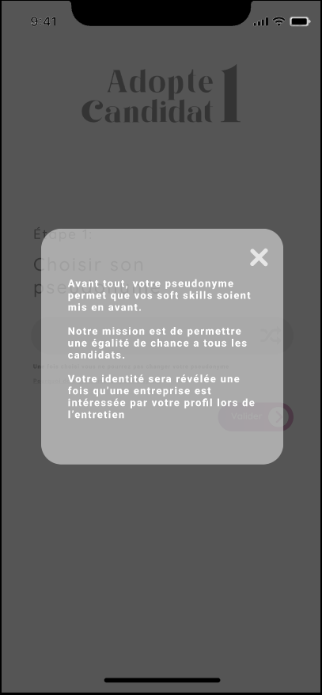 

If the user is not happy by the nickname, he can still reroll for a new one by clicking the randomize button at the right of the nickname.

Then a profile picture will be given to the user with a color, also randomly. All the profile pictures are animals:

As well as the nickname, the user will be able to reroll for a better profile picture and color if he does not like the one that was given. Every profile pictures are shown in the graphic charter section in ["images and icons"](#image-and-icons).

Then, as a main feature of the app, the user will have to choose his soft-skills that best describe him. He will be limited to 12 soft-skills to select, and the soft-skills are separated in 4 categories. You can find every detail on the soft-skills feature in the feature section in [Soft-skills](#soft-skills).

   

After finishing everything, the user will directly arrive on the main page of the app described in the [Searching companies](#searching-companies) section later in the document.

#### Company

If the user clicks on the button "une entreprise" (a company), he will arrive at first on page where he will have to enter the name of the company:

If he has chosen the wrong button (company other than candidate), he can still go back to the selection page by clicking the black arrow below on the left.

If the user decides to continue, he will have to input the main email address of the company as well as the "numéro de siret" (specific to French organization) to authenticate that the company is real and the the user create an account is not faking:

If the user has given a wrong name or is not sure, he will be able to go back.

After giving the email address and the "numéro de siret", the user arrives on a email address verification page. This will help to verify the identity of the user:

If the user has not received any code, he will be able to go back to verify that the correct email was input.

Then, after the verification validated, the user will be able to put every information necessary, starting with the logo:

The user will then be able to create a description for the company:

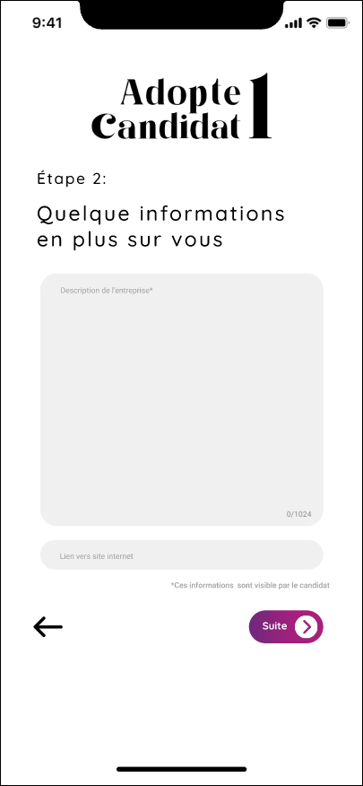

As well as what type a job he offers:

Then he will choose which soft-skills are required to be selected :

   

After finishing everything, the user will directly arrive on the main page of the app described in the [Searching candidates](#searching-candidates) section later in the document.

### Job seeker interface
---

#### Searching companies

As a main feature of the app, the candidate will be able to look for a company that perfectly suits his needs.

To do so, the candidate will have "cards" on which the company will be described on:

If you click on it, the card will flip to show the complete description that the company had provided:

To validate the company, the user will have to click on the green button with a check mark, or slide the card to the right. In the case where the user don't validate the company, he will have to click on the red button with a cross, or slide the card to the left.

Also if the user reject or validate the company by mistake, the return button at the left of the red button will let the user to bring back the last card and do again the choice.

If the user don't really know if he will reject or validate the company, the save button at the right of the green button will let the user to save the company so he will be able to do the choice later, without interfering with the match system (saved profiles will not create a match).

When the user changes page, this page will be accessible by clicking on the middle button on the navigation bar at the bottom of the screen.

#### Discussion with companies

When a match occurs, the job seeker will be able to chat with the company. He will be free to ask or tell what they want, as long as they respect the rules of communication.

To chat with a company, he will have to select to which company he wants to chat with from a list of every matches:

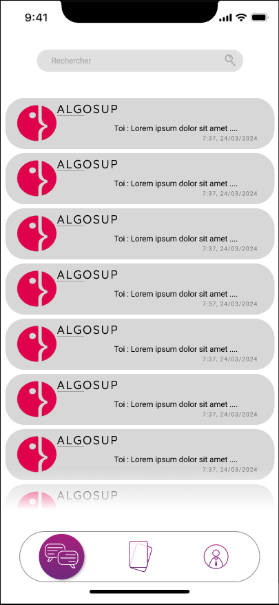

The last message will be directly visible as well as when it was send.

When the user had chosen to which company he wants to chat with, he will arrive on a chat page that looks like a standard chat interface but using the main style of the app:

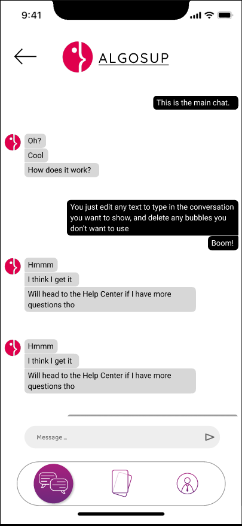

If he wants to change the company he wants to chat with, he can click on the arrow on the top left of the screen.

When the user changes page, this page will be accessible by clicking on the left button on the navigation bar at the bottom of the screen.

<h4 id="candidate-account">Account page</h4>

On the account pages, every information that the user had previously given will be shown:

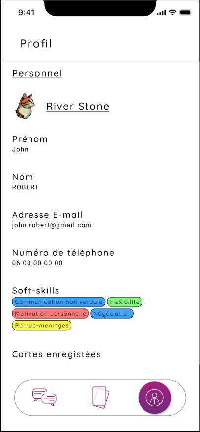 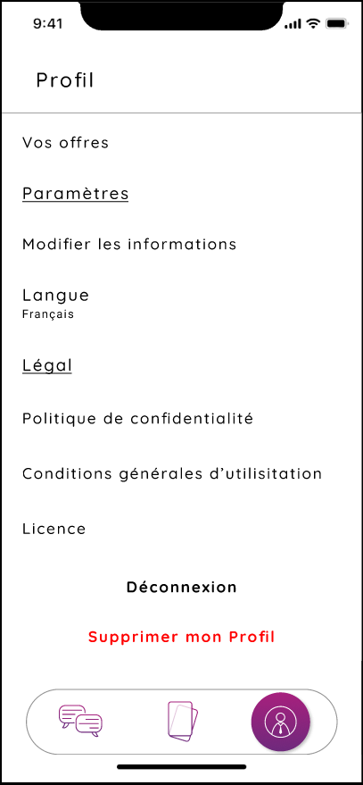

Some clickable texts will be available:
- Modify the information
- See the saved companies
- Privacy policy
- General terms of use
- License
- Disconnect
- Delete the account

More details about those clickable texts on the sections below.

When the user changes page, this page will be accessible by clicking on the right button on the navigation bar at the bottom of the screen.

#### Saved companies

When clicking on the clickable text "Saved companies" on the account page, the user will be able to see every company's profiles that he saved. The companies cards have a reduced size to see more companies at the same time:

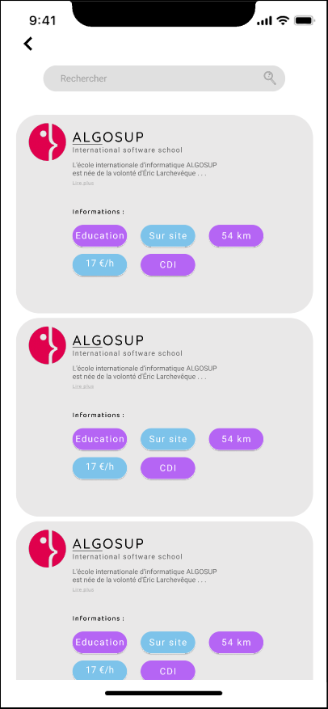

After clicking on a chosen company, the company's card will increase its size to show every details as if the user is choosing to reject or validate the company from the company selection page:

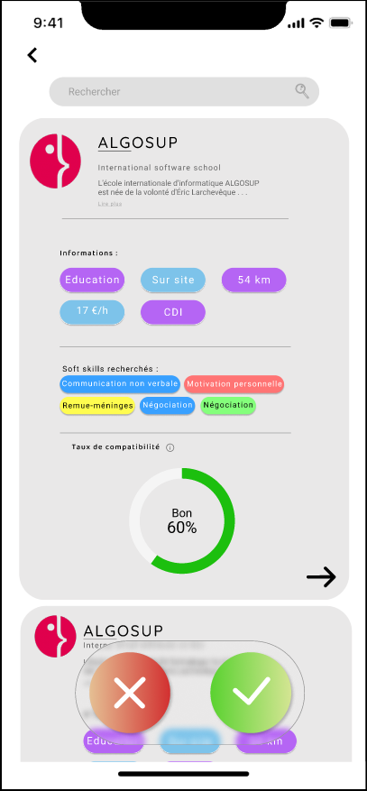 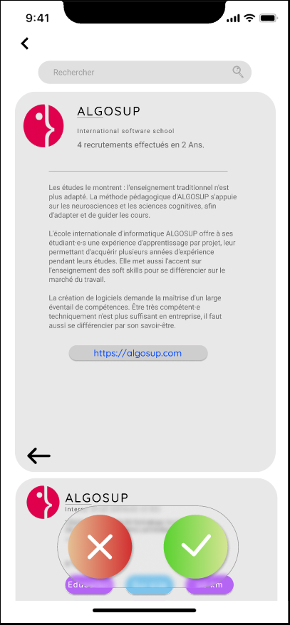

Then he can select to either reject or validate the company, or if he doesn't want to make a choice for now, he can click again on the card and its size will go back as how it was before.

To quit this page, an arrow at the top left is available. It will lead to the account page.

<h4 id="candidate-others">Others</h4>

The user will be able to get through other pages with secondary use that are still needed to have a complete app. Those pages are:
- Modify the account information
- Disconnect
- Delete the account

Those pages are accessible through the account page, by clicking on the correct clickable text (interface details in the [Account page](#candidate-account) section).

First, if the user click on "Modifier les informations" (modify the information), the user will be able to modify every information that he gave when registering, as well as the soft-skills:

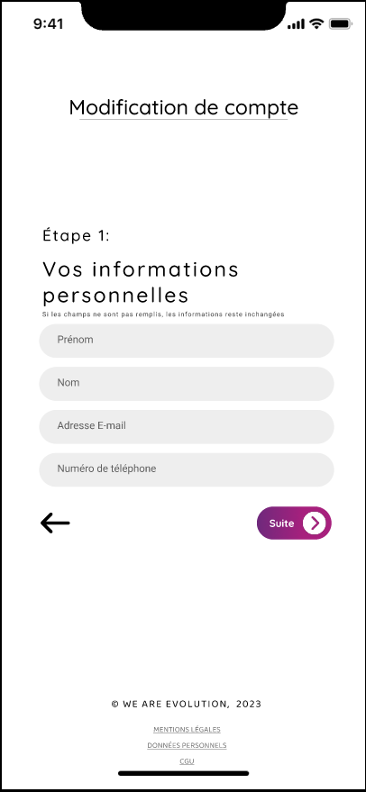

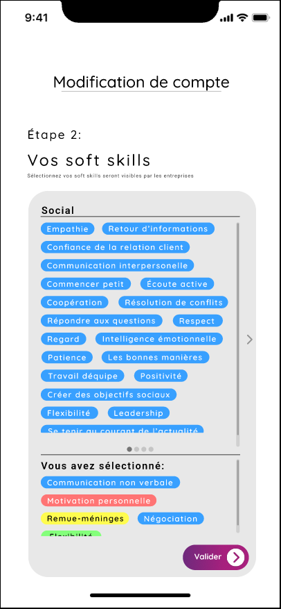 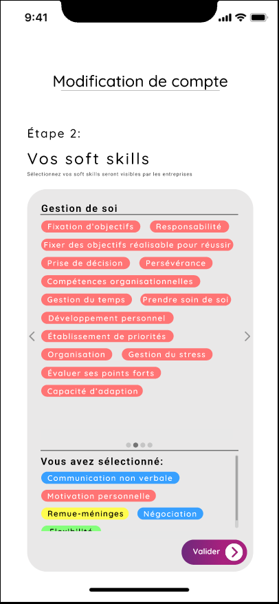 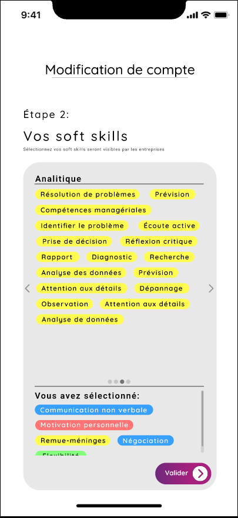 

Second, if he clicks on "Déconnexion" (disconnect), he will be directly disconnected and redirected to the connection page.

Finally, when he clicks on "Supprimer le compte" (delete the account), a message will appear to ask if the user really wants to delete his account:

If he still chooses to delete his account, a message will be shown that an email has been send to validate the deletion of the account:

The privacy policy, the general terms of use and the license are accessible via the account page. They are necessary for the rights of the app.

When the message is closed, the user will be redirected to the connection page.

### Company interface
---

The company side of the app looks pretty much the same as the candidate side apart some changes that are adapted for the companies

#### Searching candidates

The interface works the same way as the candidate side, but clicking on the card will not make the card flip to see a description:

To validate the candidate, the user will have to click on the green button with a check mark, or slide the card to the right. In the case where the user don't validate the candidate, he will have to click on the red button with a cross, or slide the card to the left.

Also if the user reject or validate the candidate by mistake, the return button at the left of the red button will let the user to bring back the last card and do again the choice.

If the user don't really know if he will reject or validate the candidate, the save button at the right of the green button will let the user to save the candidate so he will be able to do the choice later, without interfering with the match system (saved profiles will not create a match).

When the user changes page, this page will be accessible by clicking on the middle button on the navigation bar at the bottom of the screen.

#### Discussion with candidates

The interface for the chat page in the same as for the candidate side of the app with for only difference the fact that they see the candidates with which a match occurred:

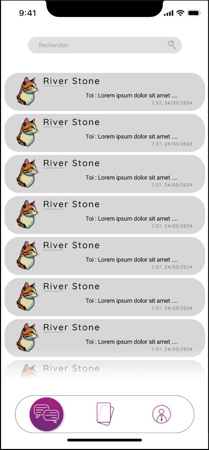

The last message will be directly visible as well as when it was send.

When the user had chosen to which candidate he wants to chat with, he will arrive on a chat page that looks like a standard chat interface but using the main style of the app:

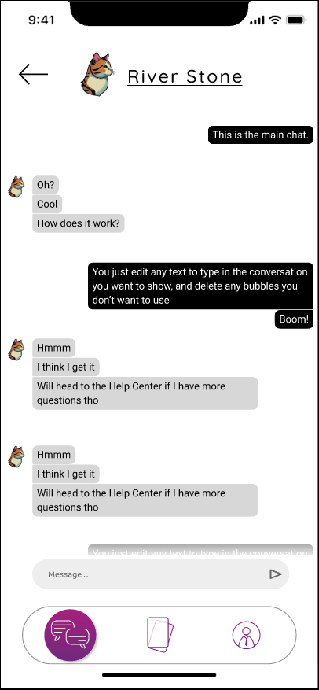

If he wants to change the candidate he wants to chat with, he can click on the arrow on the top left of the screen.

When the user changes page, this page will be accessible by clicking on the left button on the navigation bar at the bottom of the screen.

<h4 id="company-account">Account page</h4>

On the account pages, every information that the user had previously given will be shown:

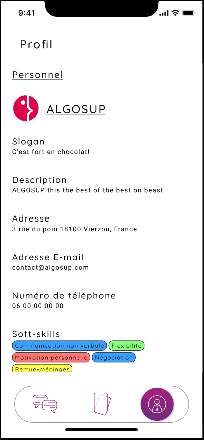 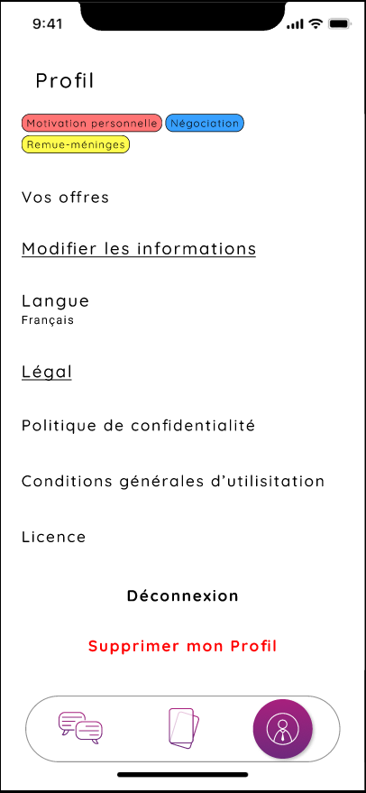

Some clickable texts will be available:
- Modify the information
- See the saved companies
- Privacy policy
- General terms of use
- License
- Disconnect
- Delete the account

More details about those clickable texts on the sections below.

When the user changes page, this page will be accessible by clicking on the right button on the navigation bar at the bottom of the screen.

#### Saved candidates

When clicking on the clickable text "Saved candidates" on the account page, the user will be able to see every candidate's profiles that he saved. The candidates cards have a reduced size to see more candidates at the same time:

Upon clicking on a chosen candidate, the candidate's card will increase its size to show every details as if the user is choosing to reject or validate the candidate from the candidate selection page:

Then he can select to either reject or validate the candidate, or if he doesn't want to make a choice for now, he can click again on the card and its size will go back as how it was before.

To quit this page, an arrow at the top left is available. It will lead to the account page.

<h4 id="company-others">Others</h4>

As well as the candidate side, the company side will have access to the same secondary pages.
Those pages are:
- Modify the account information
- Disconnect
- Delete the account

They are also accessible through the account page, by clicking on the correct clickable text (interface details in the [Account page](#company-account) section).

First, if the user click on "Modifier les informations" (modify the information), the user will be able to modify every information that he gave when registering, as well as the soft-skills:

Second, if he clicks on "Déconnexion" (disconnect), he will be directly disconnected and redirected to the connection page.

Finally, when he clicks on "Supprimer le compte" (delete the account), a message will appear to ask if the user really wants to delete his account:

If he still chooses to delete his account, a message will be shown that an email has been send to validate the deletion of the account:

The privacy policy, the general terms of use and the license are accessible via the account page. They are necessary for the rights of the app.

When the message is closed, the user will be redirected to the connection page.
  

# C. Non functional requirements

## 1. Operability

- Should be able to run on smartphone, tablet and computer
- Should run on every operating system

## 2. Delivery

- The complete application frontend will be available on our [GitHub](https://github.com/algosup/2023-2024-project-5-flutter-team-6).

## 3. Maintainability

- Commented and documented code
  

# D. Glossary

| Word | Definition | Source |
| --- | --- | --- |
| 
[1]
: Interface | A connection between a person and a computer. | [Cambridge Dictionary](https://dictionary.cambridge.org/dictionary/english/interface) |
| 
[2]
: Application | Also called app, it is a computer program that is designed for a particular purpose. | [Cambridge Dictionary](https://dictionary.cambridge.org/dictionary/english/application) |
| 
[3]
: Soft-skills | People's abilities to communicate with each other and work well together. | [Cambridge Dictionary](https://dictionary.cambridge.org/dictionary/english/soft-skills) |
| 
[4]
: Flutter | Flutter is an open-source UI software development kit created by Google. | [Wikipedia](https://en.wikipedia.org/wiki/Flutter_(software)) |
| 
[5]
: Front-end | In software engineering, front-end means the presentation layer of a piece of software. | [Wikipedia](https://en.wikipedia.org/wiki/Frontend_and_backend) |
| 
[6]
: Platform | In software engineering, it is any hardware or software used to host an application or service. | [TechTarget](https://www.techtarget.com/searchitoperations/definition/platform#:~:text=In%20IT%2C%20a%20platform%20is,a%20particular%20processor%20or%20microprocessor.) |
