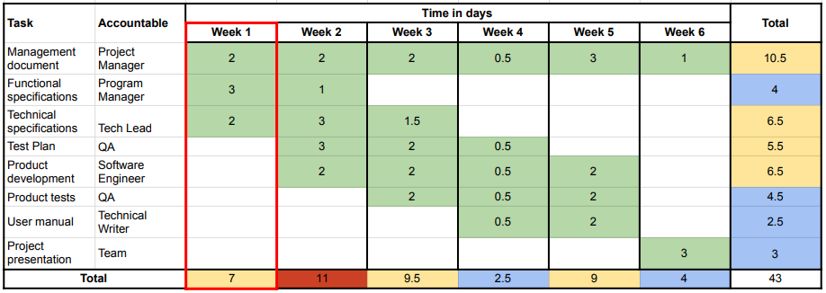
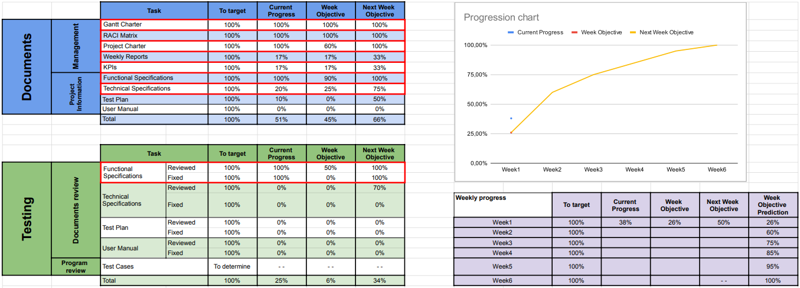

# Weekly Report 1 - 03/10/24 - 03/16/24

## Project Overview and Summary

 - <b>Project Name:</b> Sportshield
 - <b>Project Manger:</b> Evan UHRING
 - <b>Working time:</b> 21h

Briefing of the project by the client. 

Brainstorm the project with the team members.

Gantt charter finished to help having a better organization of the team. It will certainly be modified due to incomplete time schedule but this case was thought and it is adapted for this.

Trello finished to help us to be organized on the ongoing and finished tasks.

Functional specifications started and in constant progress. Technical specifications started.

Project charter started.

## Project Organization

This is used from the [Gantt Charter](../gantt-charter.pdf) of the project.

##### The current week is highlighted in red.

## Project KPIs

The current progress of the project and our prevision on the next week.

##### The ongoing tasks are highlighted in red.

## Project Risks

| Risk or Issue | Description | Owner | Status |
| -- | -- | -- | -- |
| Risk 1 | Difficulties to make the given hardware prototype work properly | Team | On going |

## Team Feedback

Good start of the project, the organization is great. Some difficulties with the prototype but we now know how to use it.