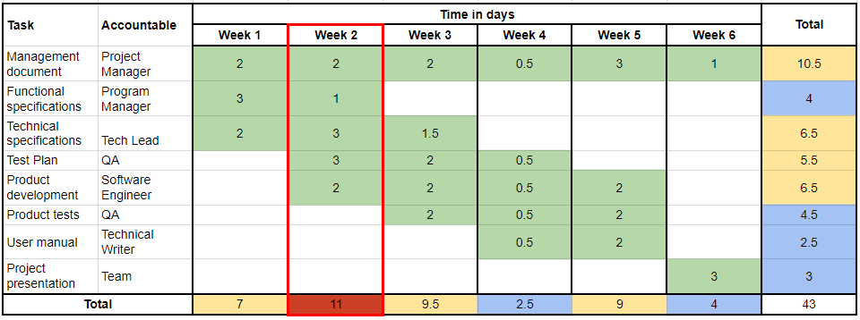

# Weekly Report 2 - 03/17/24 - 03/23/24

## Project Overview and Summary

 - <b>Project Name:</b> Sportshield
 - <b>Project Manger:</b> Evan UHRING
 - <b>Working time:</b> 24,5h

Our software engineer was not here the whole week and wasn't giving information about his absence, so the development has not nicely started.

Our tech lead has not been here also most of the time this week and we don't have more information about why he is not there at the end of the week.

## Project Organization

This is used from the [Gantt Charter](../gantt-charter.pdf) of the project.

##### The current week is highlighted in red.

## Project KPIs

The current progress of the project and our prevision on the next week.

The progression prevision through the project has been redefined, to better represent our capabilities throughout the weeks.

##### The ongoing tasks are highlighted in red.

## Project Risks

| Risk or Issue | Description | Owner | Status |
| -- | -- | -- | -- |
| Risk 1 | Difficulties to make the given hardware prototype work properly | Team | Closed |
| Risk 2 | One of our team members, our Software engineer, in absent and we can't properly start the development of the software | Gaël | Ongoing |
| Risk 3 | We don't have news about the team members | Gaël, Ian | Ongoing |

## Team Feedback

Nothing to say for this week because of the absence of two team members.