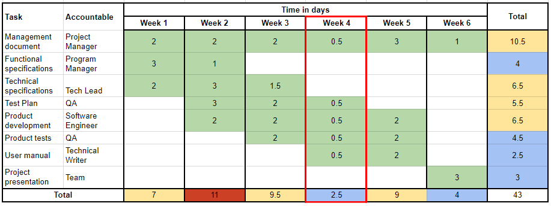
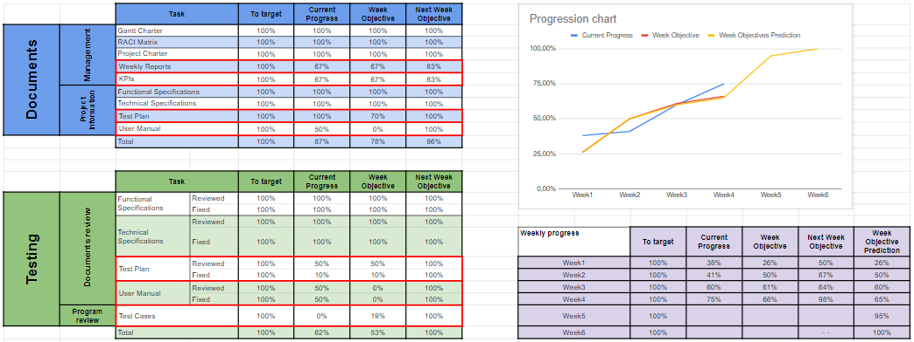

# Weekly Report 4 - 03/31/24 - 04/06/24

## Project Overview and Summary

 - <b>Project Name:</b> Sportshield
 - <b>Project Manger:</b> Evan UHRING
 - <b>Working time:</b> 3,5h

Our software engineer is still absent and the program can't progress as intended.

Everything is progressing correctly other than the program, on which we will have a lot delay. We didn't had time to think about this problem but on the next week, the team will be informed of a new plan.

## Project Organization

This is used from the [Gantt Charter](../gantt-charter.pdf) of the project.

##### The current week is highlighted in red.

## Project KPIs

The current progress of the project and our prevision on the next week.

##### The ongoing tasks are highlighted in red.

## Project Risks

| Risk or Issue | Description | Owner | Status |
| -- | -- | -- | -- |
| Risk 1 | One of our team members, our Software engineer, in absent and we can't properly start the development of the software | Gaël | Closed |
| Risk 2 | We don't have news about the team members | Gaël | Closed |

## Team Feedback

--