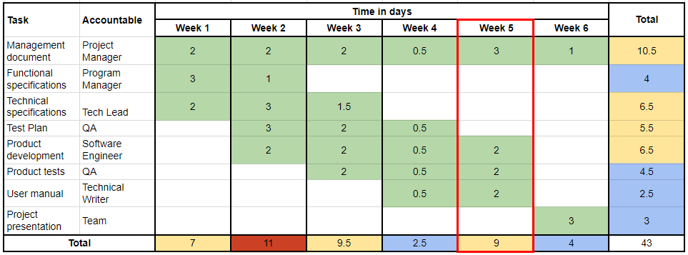
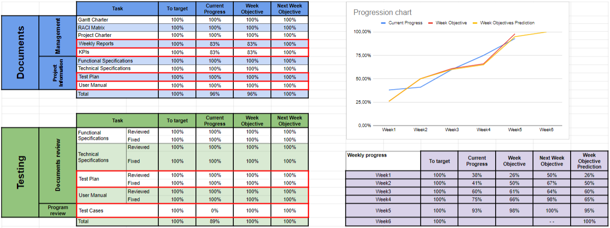

# Weekly Report 5 - 04/07/24 - 04/13/24

## Project Overview and Summary

 - <b>Project Name:</b> Sportshield
 - <b>Project Manger:</b> Evan UHRING
 - <b>Working time:</b> 7h

We have rethought of our plans for the program because of the definitive absence of one of our team member, the software engineer. We will work at maximum from this week to the end of the next week to be sure that the client will receive something. But because of our lack of knowledge on arduino, we will try our best.

We have redefined the test cases, for it to be more representative of what we have to do and what we think we can finish.

Test plan and user manual are correctly finished.

## Project Organization

This is used from the [Gantt Charter](../gantt-charter.pdf) of the project.

##### The current week is highlighted in red.

## Project KPIs

The current progress of the project and our prevision on the next week.

Changes have been made on the goals for the test cases, to better respond what we have to do and what we can do.

##### The ongoing tasks are highlighted in red.

## Project Risks

| Risk or Issue | Description | Owner | Status |
| -- | -- | -- | -- |
| Risk 1 | Our Software Engineer will not be back again | Gaël | Ongoing |

## Team Feedback

--