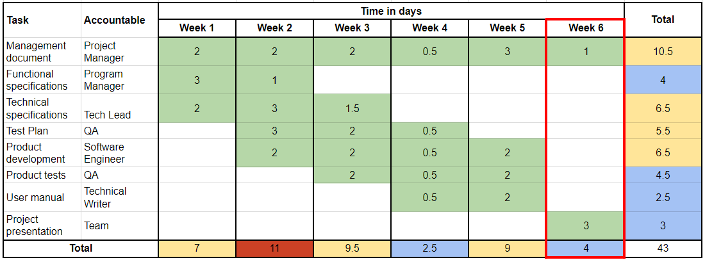
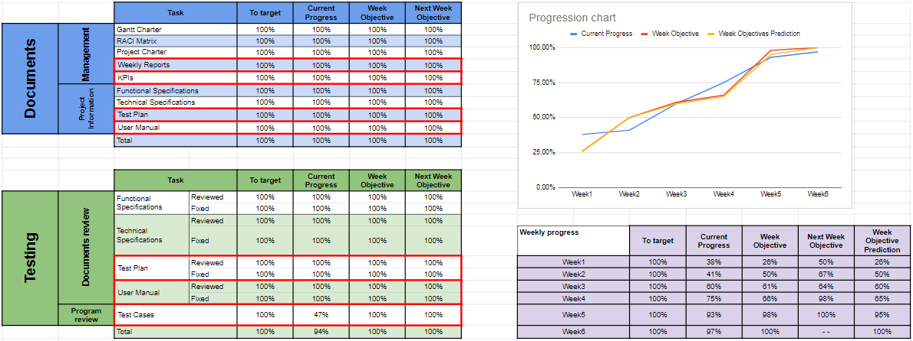

# Weekly Report 5 - 04/14/24 - 04/20/24

## Project Overview and Summary

 - <b>Project Name:</b> Sportshield
 - <b>Project Manger:</b> Evan UHRING
 - <b>Working time:</b> 21h

We managed to do some things on the program but not everything that has been requested.

We have done are presentation for Coris Innovation.

## Project Organization

This is used from the [Gantt Charter](../gantt-charter.pdf) of the project.

##### The current week is highlighted in red.

## Project KPIs

The current progress of the project and our prevision on the next week.

Changes have been made on the goals for the test cases, to better respond what we have to do and what we can do.

##### The ongoing tasks are highlighted in red.

## Project Risks

| Risk or Issue | Description | Owner | Status |
| -- | -- | -- | -- |
| Risk 1 | Our Software Engineer will not be back again | Gaël | Ongoing |

## Team Feedback

--