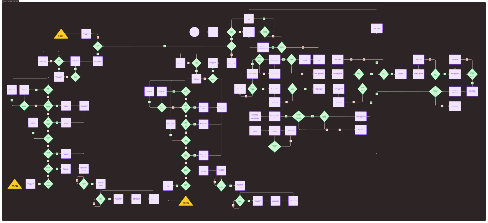

# Technical Specification

Table of content</sumarry>

- [Technical Specification](#technical-specification)
  - [Project Overview](#project-overview)
  - [1. Introduction](#1-introduction)
    - [1.1 Purpose](#11-purpose)
    - [1.2 Scope](#12-scope)
    - [1.3 Audience](#13-audience)
  - [2. System Requirements](#2-system-requirements)
    - [2.1 Functional Requirements](#21-functional-requirements)
    - [2.2 Non-Functional Requirements](#22-non-functional-requirements)
  - [3. System Architecture](#3-system-architecture)
    - [3.1 Overview](#31-overview)
    - [3.2 Flow Chart Diagram](#32-flow-chart-diagram)
    - [3.3 Data Flow Diagram](#33-data-flow-diagram)
  - [4. Detailed Design](#4-detailed-design)
    - [4.1 User Interface Design](#41-user-interface-design)
    - [4.2 Backend Design](#42-backend-design)
    - [4.3 Database Schema](#43-database-schema)
      - [Collections and Documents](#collections-and-documents)
  - [5. Development Approach](#5-development-approach)
    - [5.1 Methodology](#51-methodology)
    - [5.2 Tools and Technologies](#52-tools-and-technologies)
    - [5.3 Packages used](#53-packages-used)
    - [5.4 Software](#54-software)
    - [5.5 node.js Packages](#55-nodejs-packages)
    - [5.6 Target](#56-target)
      - [5.6.1 Android usage](#561-android-usage)
      - [5.6.2 IOS usage](#562-ios-usage)
  - [6. Testing](#6-testing)
    - [6.1 Testing Strategy](#61-testing-strategy)
    - [6.2 Tools](#62-tools)
  - [7. Deployment](#7-deployment)
    - [7.1 Deployment Pipeline](#71-deployment-pipeline)
    - [7.2 Maintenance](#72-maintenance)
  - [8. Security](#8-security)
    - [8.1 Data Security](#81-data-security)
    - [8.2 Compliance](#82-compliance)

## Project Overview

The application aims to facilitate connections between job seekers and companies through a user-friendly interface that is easily understandable for everyone, from young adults to those nearing retirement. The app uses a swipe and match system similar to popular dating apps like Tinder. It will be available on Android and iOS devices, as well as a desktop version for Linux, Windows, and MacOS.

## 1. Introduction

### 1.1 Purpose

The purpose of this document is to outline the technical specifications for the development of the job-matching application. It provides a comprehensive overview of the system requirements, architecture, functionality, and development approach.

### 1.2 Scope

The scope of the application includes:

- Development of mobile applications for Android and iOS.
- Development of a desktop version for Linux, Windows, and MacOS.
- A backend system to support user authentication, job posting, and matching algorithms.
- A user-friendly interface suitable for a wide range of users.

### 1.3 Audience

This document is intended for:

- Project Managers
- Software Engineer
- UI/UX Designers
- Quality Assurance Testers
- Stakeholders

## 2. System Requirements

### 2.1 Functional Requirements

- **User Authentication**

  - Users should be able to create accounts and log in using email or social media accounts (Google).

- **User Profiles**

  - Job seekers can create and edit profiles, including personal informations, and softskills.
  - Companies can create and edit profiles to showcase their organization and available jobs, softskilles researched.

- **Swipe and Match System**

  - Job seekers can swipe right to express interest in job postings, press the star to save the announce, and swipe left to skip.
  - Companies can see the list of jobseekers interested for each job offer, softskills of the jobseekers, distance, compatibilty score, and choose to accept or deny the jobseekers.
  - When both parties like the other, a match is made, and they can communicate via the app or the company can ask to the user if he agree to share his email address.
  
- **Messaging System**

  - Matched users can exchange messages within the app.

- **Job Search**

  - Job seekers can search for jobs based on various filters such as location, industry, and job type.
  - Companies can search for potential candidates based on softskills and compatibility score.

- **Notifications**

  - Push notifications for matches, and new messages.

### 2.2 Non-Functional Requirements

- **Performance**

  - The application should load within 3 seconds under normal conditions.

- **Scalability**

  - The backend should support scaling to accommodate a growing number of users.

- **Security**

  - Secure user data with encryption.
  - Ensure secure authentication mechanisms.

- **Compatibility**

  - Mobile applications should be compatible with version 10 and the latest versions of Android and iOS.
  - Desktop application should be compatible with version 12 and the latest versions of Linux, Windows, and MacOS.

- **Usability**

  - The interface should be intuitive and accessible to users of all age groups.

## 3. System Architecture

### 3.1 Overview

The system architecture is designed to ensure a seamless and efficient user experience across all platforms. It comprises the following components:

Mobile Applications: Android and iOS apps developed using Flutter.
Desktop Application: Developed using Flutter for compatibility across Linux, Windows, and MacOS.
Backend System: Using Cloud Firestore (Database) and Firebase Storage (Cloud Storage).
Authentication Service: Using Firebase Authentication to manage user sign-ups and logins.
Notification Service: Using Firebase Cloud Messaging (FCM) for push notifications.

### 3.2 Flow Chart Diagram

### 3.3 Data Flow Diagram

<!-- TODO: [Insert Data Flow Diagram Here] -->

## 4. Detailed Design

### 4.1 User Interface Design

The UI design focuses on providing a clean, intuitive, and user-friendly interface. It includes:

| Screen               | Description                                                                                       |
| -------------------- | ------------------------------------------------------------------------------------------------- |
| **Login Screen**     | Allow the users or company to connect to the app with their ids.                                  |
| **Register Screen**  | Display all fields require for a users or a company registration.                                 |
| **Home Screen**      | Displays a feed of job postings for job seekers and a list of potential candidates for companies. |
| **Profile Screen**   | Allows users to view and edit their profile information.                                          |
| **Favorite Screen**  | Shows the list of favorites cards, the user has saved.                                            |
| **Chat Menu Screen** | Shows a list of matches and enabled communication between job seekers and companies.              |
| **Chat Screen**      | Display a chat conversation between a company and a user.                                         |

### 4.2 Backend Design

The backend is structured to handle multiple requests efficiently and securely. Key components include:

User Management: Handling user registrations, logins, and profile management.
Job Management: CRUD operations for job postings and applications.
Matching Algorithm: Logic to match job seekers with job postings based on softskills.
Messaging Service: Enabling in-app communication between matched users.
Notification Service: Managing push notifications for matches and messages.

### 4.3 Database Schema

The database schema is designed to store user profiles, job postings, matches, messages, and notifications.

#### Collections and Documents

| Users                        |
| ---------------------------- |
| userId                       |
| name                         |
| email                        |
| passwordHash                 |
| profileInfo                  |
| softSkills                   |
| type (job seeker or company) |

| Jobs         |
| ------------ |
| jobId        |
| companyId    |
| title        |
| description  |
| requirements |
| softSkills   |
| location     |
| postDate     |
| status       |

| Matches   |
| --------- |
| matchId   |
| userId    |
| jobId     |
| companyId |
| status    |

| Messages    |
| ----------- |
| messageId   |
| matchId     |
| senderId    |
| receiverId  |
| messageText |
| timestamp   |

| Notifications  |
| -------------- |
| notificationId |
| userId         |
| type           |
| message        |
| timestamp      |
| readStatus     |

## 5. Development Approach

### 5.1 Methodology

The project will follow the Agile methodology, with development broken down into sprints. Each sprint will focus on specific features and improvements, allowing for iterative development and continuous feedback.

### 5.2 Tools and Technologies

| Category        | Tools/Technologies used                                   |
| --------------- | --------------------------------------------------------- |
| Frontend        | Flutter for cross-platform development.                   |
| Backend         | Firebase.                                                 |
| Database        | Cloud Firestore.                                          |
| Authentication  | Firebase Authentication.                                  |
| Notifications   | Firebase Cloud Messaging.                                 |
| Version Control | Git with GitHub.                                          |
| CI/CD           | GitHub Actions for continuous integration and deployment. |

### 5.3 Packages used

| Flutter Package Name | Version      | Description                                                                                                  | Links                                                                                                                    |
| -------------------- | ------------ | ------------------------------------------------------------------------------------------------------------ | ------------------------------------------------------------------------------------------------------------------------ |
| freezed              | **2.5.2**    | Code generation library that helps simplify and enhance the development of immutable data classes.           | [Doc](https://pub.dev/documentation/freezed/latest/) / [Install](https://pub.dev/packages/freezed)                       |
| riverpod             | **2.5.1**    | A provider which will help us to implement common UI patterns.                                               | [Doc](https://riverpod.dev/docs/introduction/why_riverpod) / [install](https://riverpod.dev/)                            |
| firebase-core        | **2.31.0**   | Grant access to Firebase services through the app.                                                           | [Doc](https://pub.dev/documentation/firebase_core/latest/) / [Install](https://pub.dev/packages/firebase_core)           |
| firebase-auth        | **4.19.5**   | Give the possibility for the app to use the firebase authentication systems.                                 | [Doc](https://pub.dev/documentation/firebase_auth/latest/) / [Install](https://pub.dev/packages/firebase_auth)           |
| cloud_firestore      | **4.17.3**   | Allow us to use the firebase Firestore database.                                                             | [Doc](https://pub.dev/documentation/cloud_firestore/latest/) / [Install](https://pub.dev/packages/cloud_firestore)       |
| shared_preferences   | **2.0.8**    | Used to store data localy on the user's device.                                                              | [Doc](https://pub.dev/documentation/shared_preferences/latest/) / [Install](https://pub.dev/packages/shared_preferences) |
| go_router            | **14.1.2**   | Allow us to create custom route with multiple parameters.                                                    | [Doc](https://pub.dev/documentation/go_router/latest/) / [Install](https://pub.dev/packages/go_router)                   |
| firebase_storage     | **11.7.5**   | Allow the app to access to an online cloud storage to stock files or images.                                 | [Doc](https://pub.dev/documentation/firebase_storage/latest/) / [Install](https://pub.dev/packages/firebase_storage)     |
| flutter_svg          | **2.0.10+1** | Permit to use SVG images in the app.                                                                         | [Doc](https://pub.dev/documentation/flutter_svg/latest/) / [Install](https://pub.dev/packages/flutter_svg)               |
| image_picker         | **1.1.1**    | Is used to easily access to the gallery or local folders to help user to upload a picture on the app server. | [Doc](https://pub.dev/documentation/image_picker/latest/) / [Install](https://pub.dev/packages/image_picker)             |
| geolocator           | **12.0.0**   | Can use a address to get the exact location with latitude and longitude, can also do the reverse process.    | [Doc](https://pub.dev/documentation/geolocator/latest/) / [Install](https://pub.dev/packages/geolocator)                 |
| appinio_swiper       | **2.0.0**    | Easy swipe system to drag and drop a card like on tinder.                                                    | [Doc](https://pub.dev/documentation/appinio_swiper/latest/) / [Install](https://pub.dev/packages/appinio_swiper)         |
| flip_card            | **0.7.0**    | As it's name said it, it's to add a flip animation to a card.                                                | [Doc](https://pub.dev/documentation/flip_card/latest/) / [Install](https://pub.dev/packages/flip_card)                   |

### 5.4 Software

| Name         | Link                                                                     |
| ------------ | ------------------------------------------------------------------------ |
| Firebase CLI | [Install](https://firebase.google.com/docs/cli#install_the_firebase_cli) |
| nodejs       | [Install](https://nodejs.org/en)                                         |

### 5.5 node.js Packages

| Name           | Version     | Link                                                    |
| -------------- | ----------- | ------------------------------------------------------- |
| firebase-tools | **13.10.0** | [Install](https://www.npmjs.com/package/firebase-tools) |

### 5.6 Target

We decided to target Android 12 and latest, and IOS 15 and latest, for following reasons:

#### 5.6.1 Android usage

| Android Version | API Version                 | Pourcentage of users (in 2024) |
| --------------- | --------------------------- | ------------------------------ |
| **12.0**        | **31** *(Snow Cone)*        | 15.01%                         |
| **13.0**        | **33** *(Tiramisu)*         | 26.02%                         |
| **14.0**        | **34** *(Upside Down Cake)* | 22.44%                         |
|                 | **Total**                   | 63.47%                         |

#### 5.6.2 IOS usage

| IOS Version | Pourcentage of users (in 2024) |
| ----------- | ------------------------------ |
| **15.8**    | 3.23%                          |
| **16.1**    | 3.24%                          |
| **16.6**    | 4.18%                          |
| **16.7**    | 6.02%                          |
| **17.3**    | 19.99%                         |
| **17.4**    | 42.72%                         |
| **Total**   | 79.38%                         |

## 6. Testing

### 6.1 Testing Strategy

Unit Testing: For individual components and functions.
Integration Testing: To ensure different parts of the application work together.
System Testing: To test the complete system as a whole.
User Acceptance Testing (UAT): To validate the app with end users.

### 6.2 Tools

Unit Testing: Mockito and JUnit for Flutter.
CI/CD Testing: Automated testing using GitHub Actions.
UAT: Test With random people in the street or uninvolved acquaintance.

## 7. Deployment

### 7.1 Deployment Pipeline

Staging Environment: For pre-production testing.
Production Environment: For the live application.

### 7.2 Maintenance

Regular updates and bug fixes based on user feedback and performance metrics.

## 8. Security

### 8.1 Data Security

Encryption: <!-- TODO: Write the encryption system -->
Authentication: Secure authentication using Firebase Authentication.
Authorization: Role-based access control (RBAC) for different user roles.

### 8.2 Compliance

GDPR: Ensure compliance with General Data Protection Regulation for user data protection.
HIPAA: If handling health-related job postings, ensure compliance with Health Insurance Portability and Accountability Act.

<!-- TODO: Roboto font -->
<!-- TODO: Android 31 to 34 -->
<!-- TODO: IOS 15 to latest -->
<!-- TODO: Add glossary -->
<!-- TODO: Add Appendix -->
<!-- TODO: Add link to test plan -->